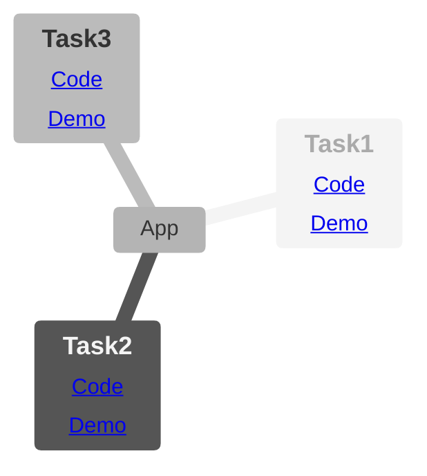

# reactTasks

Tasks collections in React

[App Live Demo](https://bklzn.github.io/reactTasks/)

## App map

```mermaid
---
config:
    theme: neutral
---
mindmap
App
    <div style="display: flex; flex-direction:column; gap: 5px"><h3 style="margin:0 1px 0 1px; color:#AAA;">Task1</h3><a href="https://github.com/Bklzn/reactTasks/tree/main/src/tasks/task1">Code</a><a href="https://bklzn.github.io/reactTasks/#/task1">Demo</a></div>
    <div style="display: flex; flex-direction:column; gap: 5px"><h3 style="margin:0 1px 0 1px;">Task2</h3><a href="https://github.com/Bklzn/reactTasks/tree/main/src/tasks/task2">Code</a><a href="https://bklzn.github.io/reactTasks/#/task2">Demo</a></div>
    <div style="display: flex; flex-direction:column; gap: 5px"><h3 style="margin:0 1px 0 1px;">Task3</h3><a href="https://github.com/Bklzn/reactTasks/tree/main/src/tasks/task3">Code</a><a href="https://bklzn.github.io/reactTasks/#/task3">Demo</a></div>
```
